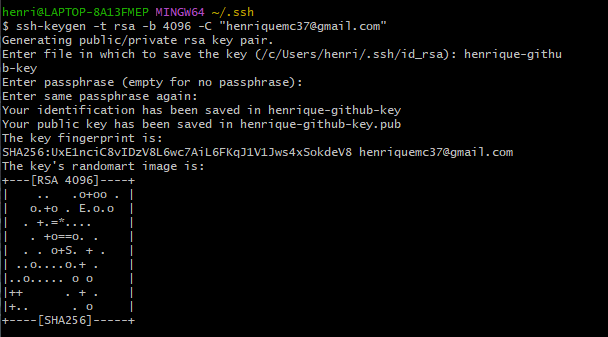
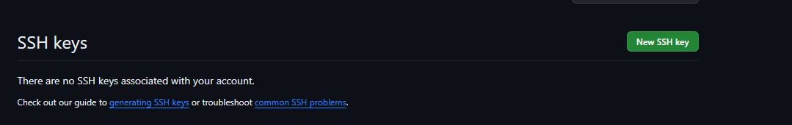
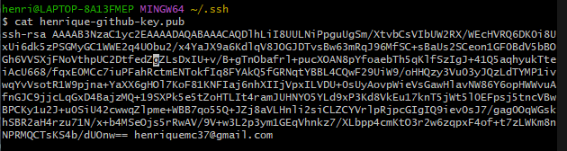
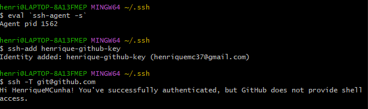
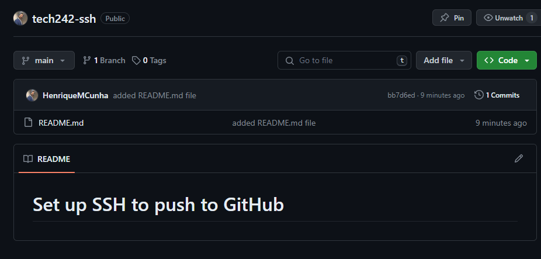

# Set up SSH to push to GitHub

- [Set up SSH to push to GitHub](#set-up-ssh-to-push-to-github)
  - [Step 1 - Generate a key pair in local machine using command:](#step-1---generate-a-key-pair-in-local-machine-using-command)
  - [Step 2 - Register public key on github](#step-2---register-public-key-on-github)
  - [Step 3 - Add private key to SSH register](#step-3---add-private-key-to-ssh-register)
  - [Step 4 - Create a new repository on GitHub to test it](#step-4---create-a-new-repository-on-github-to-test-it)
  - [Step 5 - Push changes to test repository on GitHub](#step-5---push-changes-to-test-repository-on-github)


## Step 1 - Generate a key pair in local machine using command:

`ssh-keygen -t rsa -b 4096 -C "henriquemc37@gmail.com"` 

When this command is done, we'll receive a prompt to choose file name. As well a prompt to enter passphrase (which we will leave empty).



## Step 2 - Register public key on github

* Go to Settings/SSH and GPG keys.
* Select to add new SSH key.



* Use below command to get public key in GitBash terminal:
 * `cat henrique-github-key.pub`



## Step 3 - Add private key to SSH register

  	3a. Start the SSH agent and set up necessay environment variables
     ` eval `ssh-agent -s` `
	3b. Add private key to the register
     `ssh-add henrique-github-key`
	3c. Test connection to github
	 `ssh -T git@github.com`




## Step 4 - Create a new repository on GitHub to test it

## Step 5 - Push changes to test repository on GitHub

```
echo "# Set up SSH to push to GitHub" >> README.md
git init
git add README.md
git commit -m "first commit"
git branch -M main
git remote add origin git@github.com:HenriqueMCunha/tech242-ssh.git
git push -u origin main
```
